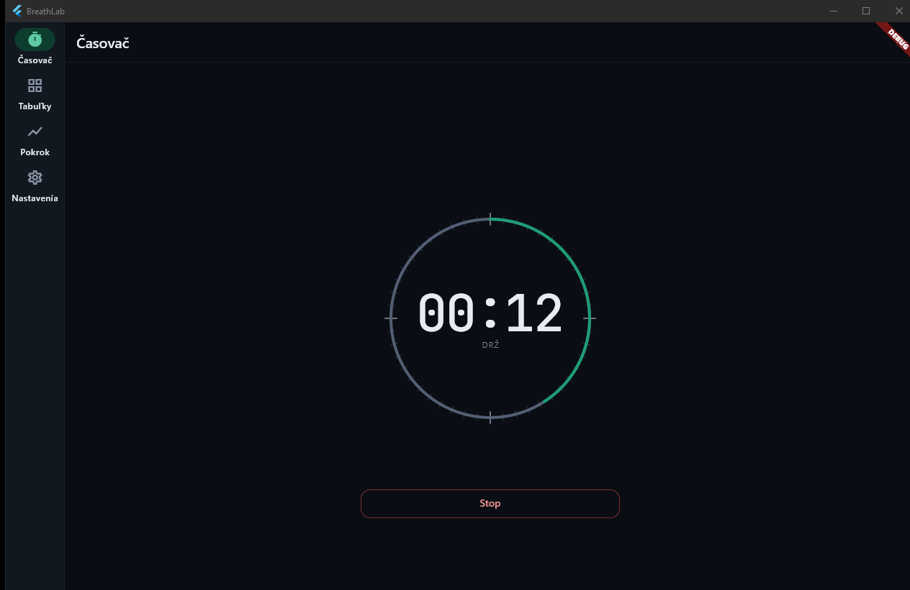
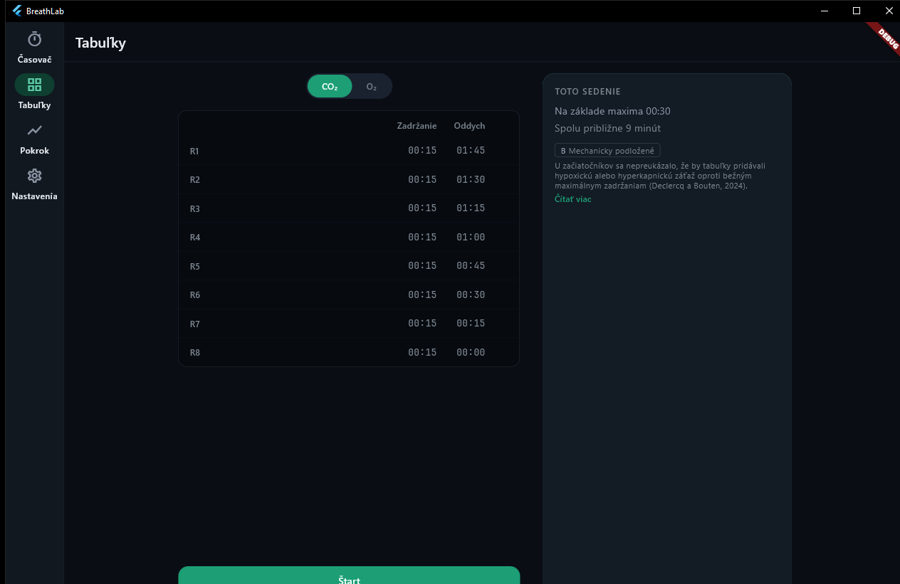
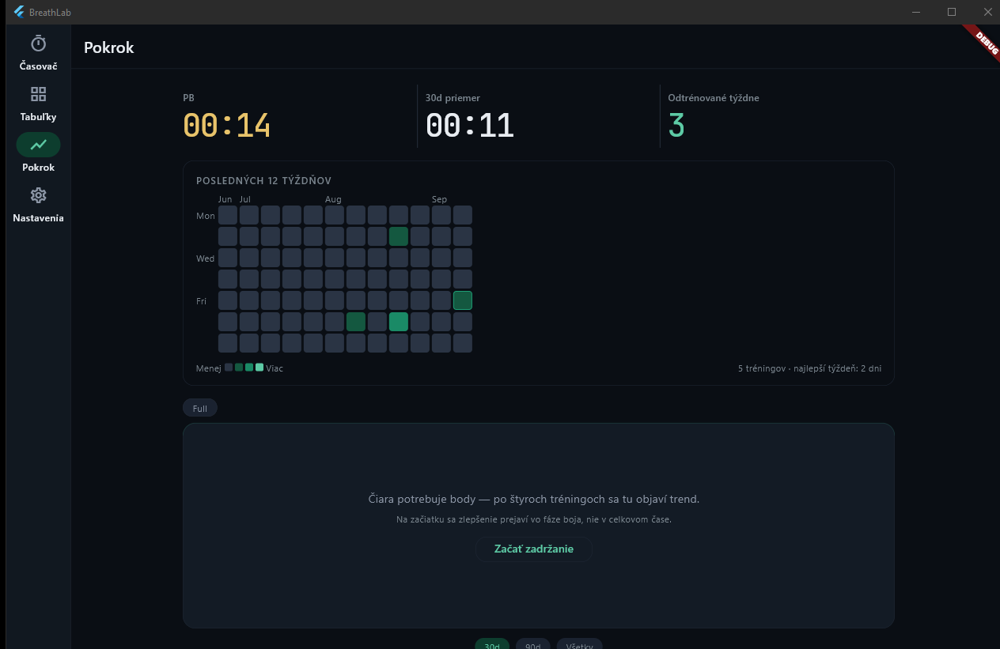

# BreathLab

A breath-hold trainer for Windows and Android that times static apnea holds, builds CO₂ and O₂ training tables from your current best, and keeps every result on the device.

[](https://github.com/Miclah/breath_lab/actions/workflows/flutter.yml) [](LICENSE)

## Contents

- [Screenshots](#screenshots)
- [About this project](#about-this-project)
- [What it does](#what-it-does)
- [Tech stack](#tech-stack)
- [Architecture and decisions](#architecture-and-decisions)
- [Running locally](#running-locally)
- [Tests and CI](#tests-and-ci)
- [Limitations](#limitations)
- [License](#license)
- [Author](#author)

## Screenshots

### Timer during a hold



### CO₂ table mid-session



### Progress



## About this project

BreathLab tracks how long you can hold your breath and gives you a structured way to improve that number. It times the hold, records the circumstances around it, and turns your current best into the two table workouts that breath-hold training is normally built on.

Everything stays on the device. There is no account and no server, and the app is not published to any store. Moving your training between devices works through a file you export and import yourself, or a direct QR-paired sync over your own Wi-Fi between two of your own devices — either way nothing passes through a server of mine. The interface is available in Slovak and English, and so are the spoken time callouts.

One constraint shaped most of the interface. The app is used lying down, eyes open, usually with something else playing, so it is built for ambient rather than focused attention. That is where the picture-in-picture window, the persistent Android notification with a live timer, the pure-black hold screen and the spoken callouts all come from: during a hold you should be able to stop looking at the phone without losing the hold.

Version one is finished apart from bug fixes and some interface tidying.

## What it does

On first launch the app shows a safety screen with three rules and refuses to go further until you acknowledge it. The acknowledgement is stored, so the screen appears once, and afterwards only when you open it deliberately from Settings.

### Timer

Pick one of three starts: straight into the hold, a three-second countdown, or a full breathe-up guided by an animated circle with a configurable inhale and exhale ratio and a skip button. During the hold a ring fills against your saved personal best. It stays teal until three quarters of it, shifts towards amber as you approach it, and turns red once you pass it. Double-tap the ring, or press `C` on a keyboard, to mark the first contraction; the result screen then reports the struggle phase as the time from that mark to the end. Space and Escape drive the whole flow on desktop.

When the hold ends you tag it. Nine built-in tags cover the usual variables (tired, well rested, full stomach, empty stomach, anxious, good prep, samba, cold, hot) and you can add your own. You also record the lung volume you started from: full, FRC, or empty. A new best triggers a sound, a haptic and a glow on the number.

### Tables

Both table types are generated from your saved maximum rather than typed in. A CO₂ table repeats one hold length, taken as a percentage of your max, while the rest shrinks by a fixed step each round until the last round has no rest at all. An O₂ table does the opposite: rest stays constant and the holds ramp linearly up to a percentage of your max on the final round. Round counts, percentages and rest values are adjustable in Settings, and each settings section renders a live preview of the resulting rounds.

The runner counts down the last three seconds of each rest with sound and haptics, advances by itself, and lets you cut a hold short without losing the session. Every round is saved as its own record, so table work still feeds the statistics without polluting the maximum-hold history.

### Progress and history

Three cards give the all-time best, the thirty-day average and the number of distinct weeks you've trained. A consecutive-days streak used to be the headline number here; it was replaced with a weekly structure-adherence percentage (shown on the Timer screen instead) because a streak punishes the rest day the training actually calls for, and a logged rest or stretch day now counts toward the week rather than breaking it. Below the three cards a twelve-week calendar heatmap shades each day by how much you did, and tapping a day opens that day's holds. The chart plots daily best over thirty days, ninety days or your entire history, with a dashed daily-average line once you filter to a single lung volume.

A plateau card appears when your best full-lung hold over the last 28 days hasn't beaten the 28 before it, and a retest prompt nudges you every few weeks to redo a max hold so the tables stay based on a current number rather than a stale one. Both surface research citations rather than asserting a verdict — see the in-app research reader below.

A separate history screen, reached from Progress rather than the bottom navigation, merges standalone holds and table sessions in reverse order and filters them by type, lung volume and tags at the same time. Individual holds open into a detail sheet where the lung volume and tags can be corrected or the hold deleted.

### Settings

Sections cover the current maximum (editable by hand, since it drives the ring, the tables and the callouts), prep defaults, inspiratory muscle training (IMST) logging against Craighead's protocol, both table shapes, the ambient behaviour described above, sound volume and haptic strength with test buttons for each, theme, and interface language. On a wide enough window a jump list beside the form scrolls to any of them. About links to the research summary, the training-system posters, the safety screen and the version.

### Evidence tiers and the research report

Every training mode carries a tier badge — A through C — that says how well the research actually supports it, shown before you commit to it rather than after. Tapping through leads to the research summary: a bundled, offline copy of the cited sources with an in-app reader, and short contextual excerpts placed next to the specific decisions they justify (the struggle-phase framing on the result screen, the IMST settings, the plateau card). It's in English only regardless of interface language, and the reader says so rather than pretending otherwise.

### Backup and moving between devices

The Data section exports everything — holds, table sessions, tags and settings — to a single `.blab` file you choose the location of, or hands it to the Android share sheet. Importing one merges it into what is already there rather than replacing it: records are matched on their UUID and the more recently updated side wins, so importing the same file twice is a no-op and importing from a second device interleaves both histories. It is a backup format and a sync mechanism at once.

The same merge logic also runs directly over your own Wi-Fi: one device hosts and shows a QR code, the other scans it to pair, and the exchange happens over a local HTTP connection between the two — no file, no account, nothing leaving the network. It's the same last-write-wins merge as the file import, just without the manual export/import step.

The same section holds the reset that wipes the database and preferences back to a fresh install, behind a confirmation and set apart from the export buttons.

## Tech stack

| Layer | Technology | Version |
| --- | --- | --- |
| Framework | Flutter, stable channel | lockfile resolves against ≥ 3.44.0 |
| Language | Dart | SDK constraint `^3.12.2` |
| State | flutter_riverpod | 2.6.1 |
| Local database | drift, drift_flutter, sqlite3_flutter_libs | 2.31.0 / 0.2.8 / 0.5.42 |
| Charts | fl_chart | 0.69.2 |
| Audio | audioplayers | 6.8.1 |
| Speech | flutter_tts | 4.2.5 |
| Notifications | flutter_local_notifications | 18.0.1 |
| Screen control | wakelock_plus, screen_brightness | 1.7.0 / 2.1.11 |
| Localisation | flutter_localizations, intl | 0.20.2 |
| Key-value storage | shared_preferences | 2.5.5 |
| LAN sync pairing | qr_flutter, mobile_scanner | 4.1.0 / 7.4.0 |
| Export/share, device info | share_plus, device_info_plus, package_info_plus | 13.3.0 / 13.2.0 / 10.2.1 |
| Lints | flutter_lints | 6.0.0 |
| Code generation | drift_dev, build_runner | 2.31.0 / 2.15.0 |

## Architecture and decisions

### Timing

A hold is measured by a `Stopwatch`, not by subtracting `DateTime` values. Wall-clock time can jump under you when the system clock is corrected or the device changes time zone, and a breath-hold record that silently gains ninety minutes is worse than no record at all.

A 50 ms `Timer.periodic` sits alongside it, but only to copy the stopwatch reading into state so the ring repaints. The moments that matter read the stopwatch directly: `stop()` takes `_holdStopwatch.elapsed` at the instant the button is pressed, and so does `markContraction()`. A saved duration is therefore never rounded to the tick grid, and the tick rate can change without changing what gets recorded. See `lib/features/timer/providers.dart`.

### Settings, and how they got rewritten

Settings live in a key-value table in SQLite rather than in preferences, so that one reset path clears everything at once.

The first version of the write path was the obvious one: each setting was a `FutureProvider`, and every control awaited its write and then invalidated the provider to read the value back. That is correct on paper and unusable in the hand. On Android, drift runs its queries in a background isolate, so nothing could move until a full round trip had finished, and a slider being dragged could not follow the finger. A failed write also disappeared without a trace.

The replacement is a small `SettingNotifier<T>` base class that applies the new value to state first, persists afterwards, and on failure restores the previous value and shows a snackbar. Every setting extends it. The reasoning is written into `lib/data/repositories/setting_notifier.dart` so that the next person to read it does not helpfully refactor it back.

Most of this codebase was written in pair-work with an AI assistant, and this is the clearest illustration of what that was actually like. The first pass was plausible, idiomatic and reviewed fine. It only fell apart when a slider was dragged on a real phone, and getting past it meant working out why drift's isolate boundary makes refetch-after-write unusable here, rather than accepting the next plausible-looking patch.

### The Android foreground service

The persistent notification with a live timer needs a real Android foreground service, and Android requires the service to declare a type. `health` was the obvious candidate and turned out to be unusable: Android insists on a companion sensor permission such as `BODY_SENSORS` or `ACTIVITY_RECOGNITION`, neither of which a breath-hold timer has any business requesting. The service is therefore declared as `specialUse` with the subtype `breath_hold_training_timer`, and the reasoning sits at the top of `android/app/src/main/AndroidManifest.xml`.

The same file declares the plugin's `ForegroundService` and its `ActionBroadcastReceiver` by hand, because the plugin's own manifest does not. `NotificationService.show()` returns `false` rather than throwing when the system refuses to start the service, which lets the timer screen show a banner instead of failing quietly.

### Data

Six drift tables at schema version 4: `Holds`, `Tags`, `HoldTags`, `Settings`, `TableSessions` and `ImstSessions`, added across three migration steps. Holds, table sessions and IMST sessions carry a UUID, creation and update timestamps, a device identifier and a soft-delete flag. Those last three are what the `.blab` merge and the LAN sync both run on: an import or a sync is a last-write-wins merge keyed on the UUID, not a replace, so importing the same file twice changes nothing and syncing with a second device interleaves both histories.

Deletion is soft and the list queries respect it. `getById` does not, so a deleted hold is still reachable by identifier, and the join table between holds and tags has no delete flag of its own. A soft-deleted row (a tombstone) is kept rather than hard-deleted so a sync partner that hasn't connected in a while still learns it's gone instead of resurrecting it — but kept forever it's a monotonic leak, so a purge on every app start hard-deletes tombstones past a six-month retention window.

The hot filters — `deleted`, and `type`/`createdAt` alongside it for the queries that recompute the personal-best flag or list history — are indexed. They weren't for most of this project's life; at the row counts a fresh install starts with, a full table scan is free, and the cost only shows up after months of daily use, which is a bad property for a bug to have.

### Localisation and theme

Nothing in the interface is a hardcoded string. The English and Slovak `.arb` files hold 331 keys each with no drift between them. Spoken callouts do not follow the interface language by default; they resolve through a separate setting, so you can read the app in Slovak and still be counted at in English, or the reverse. Slovak text-to-speech falls back to English when the device has no Slovak voice installed, and Settings warns you about that at the moment you pick it.

Colours and spacing come from `lib/theme`. One literal is left in the feature code, a three-pixel gap constant in the heatmap.

## Running locally

Requires the [Flutter SDK](https://docs.flutter.dev/get-started/install) on the stable channel, at least 3.44.0. Windows builds additionally need Visual Studio with the desktop C++ workload. Android builds need the Android SDK, and the project compiles against Java 17.

```
git clone https://github.com/Miclah/breath_lab.git
cd breath_lab
flutter pub get
```

Localisations are generated during the build (`generate: true` in `pubspec.yaml`), so there is no separate step for them. The drift schema is different: after changing anything under `lib/data/db/`, regenerate `app_database.g.dart`.

```
dart run build_runner build --delete-conflicting-outputs
```

Then run it:

```
flutter run -d windows          # Windows desktop
flutter run -d android          # a connected phone or a running emulator
```

Release builds:

```
flutter build apk --release
flutter build windows --release
```

There is nothing to configure. The app has no API keys and no environment file. Everything it stores goes into a SQLite file and a preferences store in the platform's own application data directory, and Settings has a reset that clears both.

## Tests and CI

245 tests across 38 files. The domain services are covered the way the original 43 were — both table calculators, the statistics and adherence services, plateau and retest logic, the history filter predicates, the heatmap and chart window functions — and that coverage has grown alongside the repository layer (PB-flag exclusivity, sync merge convergence and last-write-wins, drift migrations including a genuine multi-version jump) and a real set of widget tests: layout-at-multiple-widths checks for the timer stage, adaptive page, report reader and advisory cards, and end-to-end tests for the report integration and LAN sync round trip.

```
flutter test
```

What still isn't covered: the settings screens and the shell/navigation layer have no widget tests, so a layout regression there surfaces only by running the app.

[.github/workflows/flutter.yml](.github/workflows/flutter.yml) runs `flutter analyze` and `flutter test` on every push to any branch and on pull requests into `main`. It does not build an APK or an executable and it does not publish releases, so there is no artefact to download from CI.

## Limitations

There is no iOS and no web build. Neither a Mac nor an Apple developer account exists behind this project, and the web target was never wired up. Picture-in-picture and the persistent notification are Android only; on Windows both calls do nothing. Release APKs are signed with a real keystore now rather than the debug one, but the application identifier is still `com.example.breath_lab`, the placeholder Flutter generates — fine for installing on your own phone, but it would need changing before anyone else's device should trust it as the same app across updates.

A few interface affordances are further along in the data than on screen. The Focus mode toggle in Settings persists and shows explanatory text, but it currently suppresses nothing; it is a placeholder for notification suppression that has not been built. Of the three brightness overrides on the OLED hold screen, only "low" does anything, and the other two are recorded and ignored. Holds carry a `rating` column that is stored and read back but that no screen lets you set. Table sessions appear in history and in the heatmap without being openable, unlike individual holds.

## License

Apache License 2.0. See [LICENSE](LICENSE).

## Author

Michal Petrán [GitHub](https://github.com/Miclah) · [LinkedIn](https://www.linkedin.com/in/mpetran)
